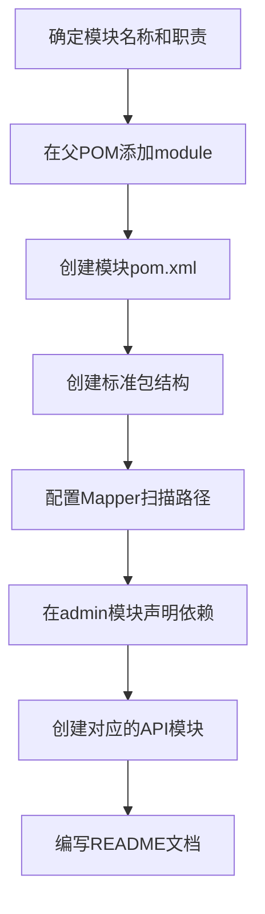

# RuoYi AI 架构设计与开发规范

## 文档说明

本文档从架构师视角全面阐述 RuoYi AI 项目的架构设计原则、模块划分规则、开发规范、数据库设计规范等，旨在指导团队统一技术栈、规范代码质量、提升开发效率。

**适用对象：** 后端开发工程师、架构师、技术负责人
**最后更新：** 2025-12-22
**项目版本：** 1.0.0

---

## 目录

1. [架构设计原则](#一架构设计原则)
2. [模块划分规范](#二模块划分规范)
3. [分层架构规范](#三分层架构规范)
4. [数据库设计规范](#四数据库设计规范)
5. [代码开发规范](#五代码开发规范)
6. [字典数据管理规范](#六字典数据管理规范)
7. [API设计规范](#七api设计规范)
8. [安全与权限规范](#八安全与权限规范)
9. [测试与质量保证](#九测试与质量保证)
10. [性能优化指南](#十性能优化指南)
11. [部署与运维规范](#十一部署与运维规范)

---

## 一、架构设计原则

### 1.1 核心设计原则

#### 1.1.1 单一职责原则 (SRP)
- 每个类、模块只负责一个功能领域
- Controller 只负责请求处理和参数验证
- Service 只负责业务逻辑编排
- Mapper 只负责数据访问

**示例：**
```java
// ✅ 好的实践
@Service
public class ChatCostServiceImpl implements IChatCostService {
    // 只负责计费相关逻辑
    @Override
    public void deductToken(ChatRequest request) { }

    @Override
    public boolean checkBalanceSufficient(ChatRequest request) { }
}

// ❌ 避免
@Service
public class ChatServiceImpl {
    // 同时负责聊天和计费，违反SRP
    public void chat() { }
    public void deductToken() { }
}
```

#### 1.1.2 开闭原则 (OCP)
- 对扩展开放，对修改封闭
- 通过接口和抽象类定义契约
- 新增功能通过添加实现类，而非修改现有代码

**示例：**
```java
// 定义接口
public interface IChatService {
    SseEmitter chat(ChatRequest request, SseEmitter emitter);
    String getCategory();
}

// 新增AI服务，只需添加实现
@Service
public class NewAIServiceImpl implements IChatService {
    @Override
    public SseEmitter chat(ChatRequest request, SseEmitter emitter) {
        // 新AI服务实现
    }

    @Override
    public String getCategory() {
        return "NEW_AI";
    }
}
```

#### 1.1.3 依赖倒置原则 (DIP)
- 高层模块不应依赖低层模块，都应依赖抽象
- 优先使用接口类型声明依赖

**示例：**
```java
// ✅ 依赖接口
@Service
@RequiredArgsConstructor
public class SseServiceImpl {
    private final IChatService chatService;  // 依赖接口
    private final IChatCostService costService;
}

// ❌ 避免直接依赖实现类
@Service
public class SseServiceImpl {
    @Autowired
    private OpenAIServiceImpl openAIService;  // 直接依赖实现
}
```

#### 1.1.4 接口隔离原则 (ISP)
- 客户端不应依赖它不需要的接口
- 细粒度的接口优于臃肿的接口

**示例：**
```java
// ✅ 接口职责清晰
public interface IChatService {
    SseEmitter chat(ChatRequest request, SseEmitter emitter);
}

public interface IChatCostService {
    void deductToken(ChatRequest request);
    boolean checkBalanceSufficient(ChatRequest request);
}

// ❌ 避免臃肿接口
public interface IMegaService {
    void chat();
    void deductToken();
    void saveMessage();
    void sendEmail();
    // ... 太多不相关方法
}
```

### 1.2 架构设计模式

#### 1.2.1 工厂模式 (Factory Pattern)

**应用场景：** 多AI服务实现的动态选择

**实现：**
```java
@Component
public class ChatServiceFactory implements ApplicationContextAware {
    private final Map<String, IChatService> chatServiceMap = new ConcurrentHashMap<>();

    @Override
    public void setApplicationContext(ApplicationContext context) {
        // 动态收集所有 IChatService 实现
        Map<String, IChatService> serviceMap = context.getBeansOfType(IChatService.class);
        for (IChatService service : serviceMap.values()) {
            chatServiceMap.put(service.getCategory(), service);
        }
    }

    public IChatService getChatService(String category) {
        IChatService service = chatServiceMap.get(category);
        if (service == null) {
            throw new ServiceException("不支持的AI类型: " + category);
        }
        return new BillingChatServiceProxy(service, chatCostService);
    }
}
```

**扩展指南：**
1. 创建新的 `IChatService` 实现类
2. 使用 `@Service` 注解注册到 Spring 容器
3. 实现 `getCategory()` 返回唯一标识
4. 工厂自动发现并注册

#### 1.2.2 策略模式 (Strategy Pattern)

**应用场景：** 不同AI平台的聊天策略

```java
// 策略接口
public interface IChatService {
    SseEmitter chat(ChatRequest request, SseEmitter emitter);
    boolean supports(String category);
}

// 具体策略
@Service
public class OpenAIServiceImpl implements IChatService {
    @Override
    public boolean supports(String category) {
        return "OPENAI".equals(category);
    }
}

@Service
public class DeepSeekChatImpl implements IChatService {
    @Override
    public boolean supports(String category) {
        return "DEEPSEEK".equals(category);
    }
}
```

#### 1.2.3 代理模式 (Proxy Pattern)

**应用场景：** 无侵入式的计费功能

```java
@RequiredArgsConstructor
public class BillingChatServiceProxy implements IChatService {
    private final IChatService delegate;  // 被代理对象
    private final IChatCostService chatCostService;

    @Override
    public SseEmitter chat(ChatRequest request, SseEmitter emitter) {
        // 前置：余额检查
        if (!chatCostService.checkBalanceSufficient(request)) {
            throw new ServiceException("余额不足");
        }

        // 执行实际业务
        BillingSseEmitter billingEmitter = new BillingSseEmitter(
            emitter, request, chatCostService);

        return delegate.chat(request, billingEmitter);
    }

    // 增强的 SseEmitter
    private static class BillingSseEmitter extends SseEmitter {
        private final StringBuilder aiResponse = new StringBuilder();

        @Override
        public void send(Object object) throws IOException {
            delegate.send(object);
            collectResponse(object);  // 收集AI回复
        }

        @Override
        public void complete() {
            saveAndBilling();  // 保存并计费
            delegate.complete();
        }
    }
}
```

**代理模式的优势：**
- 横切关注点分离（计费、日志、监控）
- 不修改原有业务代码
- 支持链式代理，灵活组合

#### 1.2.4 观察者/事件驱动模式

**应用场景：** 解耦聊天和计费

```java
// 1. 定义事件
public class ChatMessageCreatedEvent extends ApplicationEvent {
    private final Long userId;
    private final Long sessionId;
    private final String content;

    public ChatMessageCreatedEvent(Long userId, Long sessionId, String content) {
        super(userId);
        this.userId = userId;
        this.sessionId = sessionId;
        this.content = content;
    }
}

// 2. 发布事件
@Service
public class ChatMessageServiceImpl {
    @Autowired
    private ApplicationEventPublisher eventPublisher;

    public void saveMessage(ChatMessage message) {
        // 保存消息
        baseMapper.insert(message);

        // 发布事件
        eventPublisher.publishEvent(
            new ChatMessageCreatedEvent(
                message.getUserId(),
                message.getSessionId(),
                message.getContent()
            )
        );
    }
}

// 3. 监听事件
@Component
@RequiredArgsConstructor
public class BillingEventListener {
    private final IChatCostService chatCostService;

    @Async  // 异步处理
    @EventListener
    public void onChatMessageCreated(ChatMessageCreatedEvent event) {
        try {
            chatCostService.deductToken(event.getUserId(), event.getSessionId());
        } catch (Exception e) {
            log.error("计费失败", e);
        }
    }
}
```

**事件驱动的优势：**
- 业务逻辑与计费逻辑解耦
- 支持异步处理，不阻塞主流程
- 易于扩展多个监听器

---

## 二、模块划分规范

### 2.1 模块分类

RuoYi AI 采用 Maven 多模块架构，按功能和职责划分为以下模块类型：

#### 2.1.1 公共基础模块 (ruoyi-common)

**职责：** 提供跨模块共享的基础设施和工具类

**子模块规范：**

| 模块名称 | 职责 | 依赖原则 |
|---------|------|---------|
| ruoyi-common-core | 核心工具类、配置、常量 | 无外部依赖，被所有模块依赖 |
| ruoyi-common-web | Web基础（拦截器、过滤器） | 依赖 core |
| ruoyi-common-mybatis | 数据访问基础 | 依赖 core |
| ruoyi-common-satoken | 认证授权基础 | 依赖 core |
| ruoyi-common-redis | 缓存基础 | 依赖 core |
| ruoyi-common-chat | 聊天框架和OpenAI客户端 | 依赖 core |
| ruoyi-common-security | 安全拦截 | 依赖 satoken |
| ruoyi-common-log | 日志记录 | 依赖 core |
| ruoyi-common-excel | Excel导入导出 | 依赖 core |
| ruoyi-common-oss | 对象存储 | 依赖 core |

**新增公共模块checklist：**
1. ✅ 确认功能在多个业务模块中复用
2. ✅ 明确模块职责和边界
3. ✅ 在父 POM 的 `dependencyManagement` 中声明版本
4. ✅ 遵循依赖最小化原则
5. ✅ 提供完整的 README 和示例

#### 2.1.2 业务模块 (ruoyi-modules)

**职责：** 实现具体业务逻辑

**子模块规范：**

| 模块名称 | 职责 | 核心能力 |
|---------|------|---------|
| ruoyi-chat | 多平台AI对话 | OpenAI、DeepSeek、Ollama、FastGPT、Coze、DIFY |
| ruoyi-system | 系统管理 | 用户、角色、权限、菜单、部门 |
| ruoyi-graph | 知识图谱 | Neo4j、实体提取、关系推理 |
| ruoyi-aihuman | 数字人 | Live2D、语音合成、表情控制 |
| ruoyi-workflow | 工作流编排 | 流程设计、节点执行、数据流转 |
| ruoyi-generator | 代码生成 | 模板引擎、数据库元数据 |
| ruoyi-wechat | 微信集成 | 公众号、小程序 |

**新增业务模块checklist：**
1. ✅ 业务边界清晰，不与现有模块重叠
2. ✅ 创建对应的 API 模块（DTO/VO）
3. ✅ 遵循标准包结构（见3.2）
4. ✅ 配置 MyBatis-Plus mapper 扫描路径
5. ✅ 在 ruoyi-admin 中声明依赖

#### 2.1.3 API 模块 (ruoyi-modules-api)

**职责：** 定义模块间的数据传输对象和接口契约

**子模块规范：**

| 模块名称 | 包含内容 | 依赖原则 |
|---------|---------|---------|
| ruoyi-chat-api | ChatMessage、ChatSession、ChatModel 等实体 | 只依赖 common-core |
| ruoyi-knowledge-api | KnowledgeInfo、KnowledgeFragment 等 | 只依赖 common-core |
| ruoyi-system-api | SysUser、SysRole、SysMenu 等 | 只依赖 common-core |
| ruoyi-workflow-api | Workflow、WorkflowComponent 等 | 只依赖 common-core |

**API 模块设计原则：**
- **零业务逻辑：** 只包含实体类、DTO、VO
- **最小依赖：** 只依赖 common-core
- **跨模块调用：** 模块 A 调用模块 B 时，只依赖 B-api

**示例：**
```xml
<!-- ruoyi-graph 模块需要使用聊天实体 -->
<dependencies>
    <dependency>
        <groupId>org.ruoyi</groupId>
        <artifactId>ruoyi-chat-api</artifactId>  <!-- 只依赖API模块 -->
    </dependency>
</dependencies>
```

#### 2.1.4 扩展模块 (ruoyi-extend)

**职责：** 提供可选的增强功能

| 模块名称 | 职责 | 技术栈 |
|---------|------|--------|
| ruoyi-ai-copilot | Spring AI + MCP 集成 | Spring AI 1.0.0 |
| ruoyi-mcp-server | MCP 服务器实现 | Model Context Protocol |

**扩展模块设计原则：**
- **可选性：** 不影响核心功能
- **独立性：** 可独立部署或禁用
- **标准接口：** 通过接口与核心模块交互

### 2.2 标准包结构

每个业务模块必须遵循以下包结构：

```
org.ruoyi.{模块名}/
├── config/                  # 配置类
│   ├── {Module}Config.java
│   └── OkHttpConfig.java
│
├── controller/              # 控制层
│   ├── {Entity}Controller.java
│   └── ...
│
├── service/                 # 服务层
│   ├── I{Entity}Service.java        # 接口
│   ├── impl/
│   │   └── {Entity}ServiceImpl.java # 实现
│   └── proxy/               # 代理类（可选）
│       └── {Entity}Proxy.java
│
├── domain/                  # 领域模型
│   ├── {Entity}.java        # 实体（对应数据库表）
│   ├── bo/                  # 业务对象（接收请求参数）
│   │   └── {Entity}Bo.java
│   ├── vo/                  # 视图对象（返回响应）
│   │   └── {Entity}Vo.java
│   └── dto/                 # 数据传输对象（特定操作）
│       └── {Entity}DTO.java
│
├── mapper/                  # 数据访问层
│   └── {Entity}Mapper.java
│
├── enums/                   # 枚举类
│   └── {Entity}Enum.java
│
├── event/                   # 事件定义（可选）
│   └── {Entity}Event.java
│
├── listener/                # 事件监听（可选）
│   └── {Entity}Listener.java
│
├── factory/                 # 工厂类（可选）
│   └── {Entity}Factory.java
│
├── aspect/                  # 切面类（可选）
│   └── {Entity}Aspect.java
│
├── exception/               # 自定义异常（可选）
│   └── {Entity}Exception.java
│
└── util/                    # 工具类
    └── {Entity}Util.java
```

### 2.3 模块依赖管理

#### 2.3.1 依赖层次

```
ruoyi-admin（应用启动）
    ↓
ruoyi-modules（业务模块）
    ↓
ruoyi-modules-api（API契约）
    ↓
ruoyi-common（公共基础）
```

#### 2.3.2 依赖原则

1. **单向依赖：** 高层依赖低层，不允许反向依赖
2. **最小化依赖：** 只声明直接需要的依赖
3. **版本统一：** 所有版本号在父 POM 管理
4. **循环依赖禁止：** 模块 A 和 B 不能相互依赖

**示例：**
```xml
<!-- ✅ 正确：admin 依赖业务模块 -->
<dependency>
    <groupId>org.ruoyi</groupId>
    <artifactId>ruoyi-chat</artifactId>
</dependency>

<!-- ❌ 错误：业务模块不能依赖 admin -->
```

#### 2.3.3 新增模块流程



**父 POM 配置：**
```xml
<modules>
    <module>ruoyi-common</module>
    <module>ruoyi-modules</module>
    <module>ruoyi-modules-api</module>
    <module>ruoyi-admin</module>
    <module>ruoyi-extend</module>
    <!-- 新增模块在此声明 -->
</modules>

<dependencyManagement>
    <dependencies>
        <!-- 在此管理新模块版本 -->
        <dependency>
            <groupId>org.ruoyi</groupId>
            <artifactId>ruoyi-new-module</artifactId>
            <version>${revision}</version>
        </dependency>
    </dependencies>
</dependencyManagement>
```

---

## 三、分层架构规范

### 3.1 分层定义

RuoYi AI 采用经典的三层架构 + DTO/VO 传输对象：

```
┌─────────────────────────────────────┐
│      Controller 层（表现层）          │
│  ↓ 接收请求、参数验证、返回响应        │
├─────────────────────────────────────┤
│      Service 层（业务逻辑层）         │
│  ↓ 业务规则、事务管理、逻辑编排        │
├─────────────────────────────────────┤
│     Mapper 层（数据访问层）           │
│  ↓ CRUD操作、SQL执行                 │
└─────────────────────────────────────┘
         ↕
    DTO/BO/VO/Entity
   （数据传输对象）
```

### 3.2 Controller 层规范

#### 3.2.1 职责边界

- ✅ **应该做：**
  - 接收HTTP请求
  - 参数验证（@Valid、@Validated）
  - 调用 Service 层
  - 返回统一响应格式 R<T>
  - 权限检查注解（@SaCheckPermission）
  - 操作日志注解（@Log）

- ❌ **不应该做：**
  - 业务逻辑处理
  - 直接操作数据库
  - 复杂计算
  - 事务管理

#### 3.2.2 标准写法

```java
/**
 * AI聊天配置控制器
 *
 * @author ruoyi
 * @date 2025-01-01
 */
@Slf4j
@Validated
@RequiredArgsConstructor
@RestController
@RequestMapping("/chat/config")
public class ChatConfigController extends BaseController {

    private final IChatConfigService chatConfigService;

    /**
     * 查询配置列表
     */
    @SaCheckPermission("chat:config:list")
    @GetMapping("/list")
    public TableDataInfo<ChatConfigVo> list(ChatConfigBo bo, PageQuery pageQuery) {
        return chatConfigService.queryPageList(bo, pageQuery);
    }

    /**
     * 获取配置详情
     */
    @SaCheckPermission("chat:config:query")
    @GetMapping("/{id}")
    public R<ChatConfigVo> getInfo(@PathVariable Long id) {
        return R.ok(chatConfigService.queryById(id));
    }

    /**
     * 新增配置
     */
    @Log(title = "AI配置", businessType = BusinessType.INSERT)
    @SaCheckPermission("chat:config:add")
    @RepeatSubmit  // 防止重复提交
    @PostMapping
    public R<Void> add(@Validated @RequestBody ChatConfigBo bo) {
        return toAjax(chatConfigService.insertByBo(bo));
    }

    /**
     * 修改配置
     */
    @Log(title = "AI配置", businessType = BusinessType.UPDATE)
    @SaCheckPermission("chat:config:edit")
    @RepeatSubmit
    @PutMapping
    public R<Void> edit(@Validated @RequestBody ChatConfigBo bo) {
        return toAjax(chatConfigService.updateByBo(bo));
    }

    /**
     * 删除配置
     */
    @Log(title = "AI配置", businessType = BusinessType.DELETE)
    @SaCheckPermission("chat:config:remove")
    @DeleteMapping("/{ids}")
    public R<Void> remove(@PathVariable Long[] ids) {
        return toAjax(chatConfigService.deleteByIds(Arrays.asList(ids)));
    }
}
```

#### 3.2.3 Controller 注解规范

| 注解 | 用途 | 必须 | 示例 |
|-----|------|------|------|
| @RestController | 标识REST控制器 | ✅ | - |
| @RequestMapping | 配置基础路径 | ✅ | `/chat/config` |
| @Validated | 启用参数验证 | ✅ | - |
| @RequiredArgsConstructor | 构造函数注入 | ✅ | Lombok |
| @Slf4j | 日志功能 | 推荐 | Lombok |
| @SaCheckPermission | 权限校验 | 业务需要 | `"chat:config:list"` |
| @Log | 操作日志 | 增删改 | `title = "配置管理"` |
| @RepeatSubmit | 防重复提交 | 增删改 | - |

### 3.3 Service 层规范

#### 3.3.1 接口定义

```java
/**
 * AI配置服务接口
 */
public interface IChatConfigService {

    /**
     * 查询单个配置
     * @param id 主键
     * @return 配置信息
     */
    ChatConfigVo queryById(Long id);

    /**
     * 查询配置列表
     * @param bo 查询条件
     * @return 配置列表
     */
    List<ChatConfigVo> queryList(ChatConfigBo bo);

    /**
     * 分页查询配置列表
     * @param bo 查询条件
     * @param pageQuery 分页参数
     * @return 分页结果
     */
    TableDataInfo<ChatConfigVo> queryPageList(ChatConfigBo bo, PageQuery pageQuery);

    /**
     * 新增配置
     * @param bo 配置信息
     * @return 是否成功
     */
    Boolean insertByBo(ChatConfigBo bo);

    /**
     * 修改配置
     * @param bo 配置信息
     * @return 是否成功
     */
    Boolean updateByBo(ChatConfigBo bo);

    /**
     * 删除配置
     * @param ids 主键集合
     * @return 是否成功
     */
    Boolean deleteByIds(Collection<Long> ids);
}
```

#### 3.3.2 实现类规范

```java
/**
 * AI配置服务实现
 */
@Service
@RequiredArgsConstructor
public class ChatConfigServiceImpl implements IChatConfigService {

    private final ChatConfigMapper baseMapper;

    @Override
    public ChatConfigVo queryById(Long id) {
        return baseMapper.selectVoById(id);
    }

    @Override
    public TableDataInfo<ChatConfigVo> queryPageList(ChatConfigBo bo, PageQuery pageQuery) {
        LambdaQueryWrapper<ChatConfig> lqw = buildQueryWrapper(bo);
        Page<ChatConfigVo> result = baseMapper.selectVoPage(pageQuery.build(), lqw);
        return TableDataInfo.build(result);
    }

    @Override
    public Boolean insertByBo(ChatConfigBo bo) {
        ChatConfig add = MapstructUtils.convert(bo, ChatConfig.class);
        validEntityBeforeSave(add);
        boolean flag = baseMapper.insert(add) > 0;
        if (flag) {
            bo.setId(add.getId());
        }
        return flag;
    }

    @Override
    @Transactional(rollbackFor = Exception.class)
    public Boolean updateByBo(ChatConfigBo bo) {
        ChatConfig update = MapstructUtils.convert(bo, ChatConfig.class);
        validEntityBeforeSave(update);
        return baseMapper.updateById(update) > 0;
    }

    /**
     * 构建查询条件
     */
    private LambdaQueryWrapper<ChatConfig> buildQueryWrapper(ChatConfigBo bo) {
        Map<String, Object> params = bo.getParams();
        LambdaQueryWrapper<ChatConfig> lqw = Wrappers.lambdaQuery();
        lqw.like(StringUtils.isNotBlank(bo.getConfigName()),
                 ChatConfig::getConfigName, bo.getConfigName());
        lqw.eq(StringUtils.isNotBlank(bo.getCategory()),
               ChatConfig::getCategory, bo.getCategory());
        return lqw;
    }

    /**
     * 保存前数据校验
     */
    private void validEntityBeforeSave(ChatConfig entity) {
        // TODO 做一些数据校验，如唯一约束
    }
}
```

#### 3.3.3 Service 层职责

- ✅ **应该做：**
  - 业务规则校验
  - 事务管理（@Transactional）
  - 调用多个 Mapper
  - BO 转 Entity
  - Entity 转 VO
  - 发布领域事件

- ❌ **不应该做：**
  - 参数验证（Controller 层）
  - 直接拼接 SQL
  - HTTP 请求处理
  - 权限检查

### 3.4 Mapper 层规范

#### 3.4.1 Mapper 接口

```java
/**
 * AI配置 Mapper
 *
 * @author ruoyi
 */
@Mapper
public interface ChatConfigMapper extends BaseMapperPlus<ChatConfig, ChatConfigVo> {

    /**
     * 自定义查询方法（复杂SQL）
     */
    List<ChatConfigVo> selectConfigByCategory(@Param("category") String category);
}
```

#### 3.4.2 Mapper XML

```xml
<?xml version="1.0" encoding="UTF-8" ?>
<!DOCTYPE mapper PUBLIC "-//mybatis.org//DTD Mapper 3.0//EN"
    "http://mybatis.org/dtd/mybatis-3-mapper.dtd">
<mapper namespace="org.ruoyi.chat.mapper.ChatConfigMapper">

    <!-- 自定义查询 -->
    <select id="selectConfigByCategory" resultType="org.ruoyi.chat.domain.vo.ChatConfigVo">
        SELECT
            id, category, config_name, config_value
        FROM
            chat_config
        WHERE
            category = #{category}
            AND del_flag = '0'
        ORDER BY
            create_time DESC
    </select>
</mapper>
```

#### 3.4.3 MyBatis-Plus 扩展

RuoYi AI 扩展了 `BaseMapperPlus`，提供以下增强方法：

```java
public interface BaseMapperPlus<T, V> extends BaseMapper<T> {

    /**
     * 查询单个VO
     */
    default V selectVoById(Serializable id) { }

    /**
     * 查询VO列表
     */
    default List<V> selectVoList(Wrapper<T> wrapper) { }

    /**
     * 分页查询VO
     */
    default <P extends IPage<V>> P selectVoPage(P page, Wrapper<T> wrapper) { }

    /**
     * 批量插入
     */
    boolean insertBatch(Collection<T> entityList);
}
```

### 3.5 数据传输对象规范

#### 3.5.1 Entity（实体类）

**用途：** 映射数据库表

```java
/**
 * AI配置表 chat_config
 */
@Data
@TableName("chat_config")
public class ChatConfig extends BaseEntity {

    /**
     * 主键
     */
    @TableId(value = "id", type = IdType.ASSIGN_ID)
    private Long id;

    /**
     * 配置类型
     */
    private String category;

    /**
     * 配置名称
     */
    private String configName;

    /**
     * 配置值
     */
    private String configValue;

    /**
     * 删除标志（0正常 2删除）
     */
    @TableLogic
    private String delFlag;
}
```

**注解说明：**
- `@TableName`: 指定数据库表名
- `@TableId`: 主键，ASSIGN_ID 使用雪花算法
- `@TableLogic`: 逻辑删除字段
- `@TableField`: 自定义字段映射

#### 3.5.2 BO（业务对象）

**用途：** 接收前端请求参数

```java
/**
 * AI配置业务对象
 */
@Data
@EqualsAndHashCode(callSuper = true)
public class ChatConfigBo extends BaseEntity {

    /**
     * 主键
     */
    @NotNull(message = "主键不能为空", groups = { EditGroup.class })
    private Long id;

    /**
     * 配置类型
     */
    @NotBlank(message = "配置类型不能为空", groups = { AddGroup.class, EditGroup.class })
    private String category;

    /**
     * 配置名称
     */
    @NotBlank(message = "配置名称不能为空", groups = { AddGroup.class, EditGroup.class })
    private String configName;

    /**
     * 配置值
     */
    @NotBlank(message = "配置值不能为空", groups = { AddGroup.class, EditGroup.class })
    private String configValue;
}
```

**验证分组：**
- `AddGroup.class`: 新增时验证
- `EditGroup.class`: 编辑时验证
- 无分组：所有操作都验证

#### 3.5.3 VO（视图对象）

**用途：** 返回给前端的数据

```java
/**
 * AI配置视图对象
 */
@Data
public class ChatConfigVo implements Serializable {

    private static final long serialVersionUID = 1L;

    /**
     * 主键
     */
    private Long id;

    /**
     * 配置类型
     */
    private String category;

    /**
     * 配置名称
     */
    private String configName;

    /**
     * 配置值
     */
    private String configValue;

    /**
     * 创建时间
     */
    @JsonFormat(pattern = "yyyy-MM-dd HH:mm:ss")
    private Date createTime;
}
```

**特点：**
- 只包含需要返回的字段
- 敏感字段过滤（如密码）
- 日期格式化（@JsonFormat）
- 关联对象（如创建人姓名）

#### 3.5.4 DTO（数据传输对象）

**用途：** 特定场景的数据载体

```java
/**
 * 聊天请求DTO
 */
@Data
public class ChatRequest {

    /**
     * 用户ID
     */
    private Long userId;

    /**
     * 会话ID
     */
    private Long sessionId;

    /**
     * 消息内容
     */
    private String content;

    /**
     * 模型类别
     */
    private String category;

    /**
     * 知识库ID（可选）
     */
    private Long knowledgeId;
}
```

### 3.6 对象转换规范

使用 **MapStruct Plus** 进行对象转换：

```java
// BO → Entity
ChatConfig entity = MapstructUtils.convert(bo, ChatConfig.class);

// Entity → VO
ChatConfigVo vo = MapstructUtils.convert(entity, ChatConfigVo.class);

// List<Entity> → List<VO>
List<ChatConfigVo> voList = MapstructUtils.convert(entityList, ChatConfigVo.class);
```

**禁止手动转换：**
```java
// ❌ 不推荐
ChatConfig entity = new ChatConfig();
entity.setId(bo.getId());
entity.setCategory(bo.getCategory());
// ... 繁琐且容易出错
```

---

## 四、数据库设计规范

### 4.1 表命名规范

#### 4.1.1 命名规则

| 规则 | 说明 | 示例 |
|-----|------|------|
| 小写 + 下划线 | 全部小写，单词间用下划线分隔 | `chat_message` |
| 模块前缀 | 表名以模块名开头 | `chat_*`、`sys_*`、`graph_*` |
| 语义明确 | 表名能清晰表达业务含义 | `chat_pay_order`（支付订单） |
| 单数形式 | 使用单数而非复数 | `sys_user`（不是 users） |

#### 4.1.2 模块前缀

| 前缀 | 模块 | 示例 |
|-----|------|------|
| `chat_` | 聊天模块 | `chat_message`、`chat_session` |
| `sys_` | 系统管理 | `sys_user`、`sys_role` |
| `graph_` | 知识图谱 | `graph_entity_type`、`graph_relation_type` |
| `knowledge_` | 知识库 | `knowledge_info`、`knowledge_fragment` |
| `t_` | 工作流 | `t_workflow`、`t_workflow_component` |
| `dev_` | 代码生成 | `dev_schema`、`dev_schema_field` |
| `mcp_` | MCP协议 | `mcp_info` |

### 4.2 字段命名规范

#### 4.2.1 字段命名规则

| 规则 | 说明 | 示例 |
|-----|------|------|
| 小写 + 下划线 | 全部小写，单词间下划线 | `user_id`、`config_name` |
| 语义明确 | 见名知意 | `total_tokens`（总token数） |
| 避免保留字 | 不使用MySQL保留字 | ❌ `order`、`group` |
| 布尔类型 | 以 `is_` 或 `has_` 开头 | `is_enabled`、`has_permission` |

#### 4.2.2 标准字段

**所有业务表必须包含：**

```sql
CREATE TABLE `xxx_table` (
    `id` bigint(20) NOT NULL COMMENT '主键',

    -- 业务字段
    ...

    -- 标准字段（必须）
    `create_dept` bigint(20) NULL DEFAULT NULL COMMENT '创建部门',
    `create_by` bigint(20) NULL DEFAULT NULL COMMENT '创建者',
    `create_time` datetime NULL DEFAULT NULL COMMENT '创建时间',
    `update_by` bigint(20) NULL DEFAULT NULL COMMENT '更新者',
    `update_time` datetime NULL DEFAULT NULL COMMENT '更新时间',
    `remark` varchar(500) NULL DEFAULT NULL COMMENT '备注',
    `del_flag` char(1) NULL DEFAULT '0' COMMENT '删除标志（0正常 1删除）',

    PRIMARY KEY (`id`)
) ENGINE=InnoDB DEFAULT CHARSET=utf8mb4 COMMENT='表注释';
```

**多租户表额外包含：**
```sql
`tenant_id` bigint(20) NOT NULL DEFAULT 0 COMMENT '租户ID',
```

#### 4.2.3 字段类型规范

| Java类型 | MySQL类型 | 说明 |
|---------|----------|------|
| Long | bigint(20) | 主键、外键、雪花ID |
| Integer | int(11) | 数量、状态 |
| String | varchar(n) | 短文本，n根据实际需要 |
| String | text / longtext | 长文本、JSON |
| BigDecimal | decimal(10,2) | 金额、价格 |
| Date | datetime | 时间 |
| Boolean | char(1) | 标志位（'0'/'1'） |

**金额字段规范：**
```sql
`amount` decimal(10, 2) NOT NULL COMMENT '金额',
`deduct_cost` decimal(10, 2) NULL DEFAULT 0.00 COMMENT '扣除金额',
```

- 使用 `decimal` 而非 `double`
- 精度 `(10, 2)` 表示最大10位，小数2位

### 4.3 索引设计规范

#### 4.3.1 主键索引

```sql
PRIMARY KEY (`id`) USING BTREE
```

- 所有表必须有主键
- 使用 `bigint(20)` 类型
- 使用雪花算法生成（`IdType.ASSIGN_ID`）

#### 4.3.2 唯一索引

```sql
UNIQUE INDEX `unique_category_key`(`category`, `config_name`) USING BTREE
```

**应用场景：**
- 业务唯一性约束
- 防止重复数据

**命名规范：**
- `unique_` + 字段名组合

#### 4.3.3 普通索引

```sql
INDEX `idx_user_id`(`user_id`) USING BTREE,
INDEX `idx_session_id`(`session_id`) USING BTREE,
INDEX `idx_create_time`(`create_time`) USING BTREE
```

**应用场景：**
- 高频查询字段
- WHERE 条件字段
- ORDER BY 字段
- JOIN 关联字段

**命名规范：**
- `idx_` + 字段名
- 联合索引：`idx_` + 字段1 + `_` + 字段2

#### 4.3.4 索引设计原则

1. **选择性高的字段建索引**
   - ✅ `user_id`（区分度高）
   - ❌ `gender`（只有2-3个值）

2. **联合索引最左前缀原则**
   ```sql
   INDEX `idx_user_session`(`user_id`, `session_id`)
   ```
   - 可命中：`WHERE user_id = ? AND session_id = ?`
   - 可命中：`WHERE user_id = ?`
   - ❌ 不命中：`WHERE session_id = ?`

3. **避免过多索引**
   - 影响 INSERT/UPDATE 性能
   - 占用存储空间
   - 建议单表索引不超过5个

### 4.4 字段注释规范

```sql
CREATE TABLE `chat_message` (
    `id` bigint(20) NOT NULL COMMENT '主键',
    `user_id` bigint(20) NOT NULL COMMENT '用户ID',
    `session_id` bigint(20) NULL DEFAULT NULL COMMENT '会话ID',
    `content` longtext NULL COMMENT '消息内容',
    `role` varchar(255) NULL DEFAULT NULL COMMENT '对话角色（user/assistant/system）',
    `deduct_cost` decimal(10, 2) NULL DEFAULT 0.00 COMMENT '扣除金额',
    `total_tokens` int(20) NULL DEFAULT 0 COMMENT '累计Tokens',
    `billing_type` char(1) NULL DEFAULT NULL COMMENT '计费类型（1-token计费 2-次数计费 null-普通消息）'
) ENGINE=InnoDB DEFAULT CHARSET=utf8mb4 COMMENT='聊天消息表';
```

**注释规范：**
- 所有表必须有 COMMENT
- 所有字段必须有 COMMENT
- 枚举值在注释中说明含义
- 外键关联说明关联表

### 4.5 逻辑删除规范

```sql
`del_flag` char(1) NULL DEFAULT '0' COMMENT '删除标志（0正常 1删除）'
```

**Entity 配置：**
```java
@TableLogic
private String delFlag;
```

**MyBatis-Plus 全局配置：**
```yaml
mybatis-plus:
  global-config:
    db-config:
      logic-delete-field: delFlag
      logic-delete-value: 1  # 删除值
      logic-not-delete-value: 0  # 正常值
```

**效果：**
- `DELETE FROM table WHERE id = ?` → `UPDATE table SET del_flag = 1 WHERE id = ?`
- `SELECT * FROM table` → `SELECT * FROM table WHERE del_flag = 0`

### 4.6 表设计示例

#### 4.6.1 标准业务表

```sql
DROP TABLE IF EXISTS `chat_config`;
CREATE TABLE `chat_config` (
    `id` bigint(20) NOT NULL AUTO_INCREMENT COMMENT '主键',
    `category` varchar(255) NOT NULL COMMENT '配置类型',
    `config_name` varchar(255) NOT NULL COMMENT '配置名称',
    `config_value` text NOT NULL COMMENT '配置值',
    `config_dict` varchar(255) NULL DEFAULT NULL COMMENT '说明',

    `create_dept` bigint(20) NULL DEFAULT NULL COMMENT '创建部门',
    `create_by` varchar(64) NULL DEFAULT '' COMMENT '创建者',
    `create_time` datetime NULL DEFAULT NULL COMMENT '创建时间',
    `update_by` varchar(64) NULL DEFAULT '' COMMENT '更新者',
    `update_time` datetime NULL DEFAULT NULL COMMENT '更新时间',
    `remark` varchar(500) NULL DEFAULT NULL COMMENT '备注',
    `version` int(11) NULL DEFAULT NULL COMMENT '版本（乐观锁）',
    `del_flag` char(1) NULL DEFAULT '0' COMMENT '删除标志（0正常 1删除）',
    `update_ip` varchar(128) NULL DEFAULT NULL COMMENT '更新IP',
    `tenant_id` bigint(20) NOT NULL DEFAULT 0 COMMENT '租户ID',

    PRIMARY KEY (`id`) USING BTREE,
    UNIQUE INDEX `unique_category_key`(`category`, `config_name`) USING BTREE
) ENGINE=InnoDB AUTO_INCREMENT=1 DEFAULT CHARSET=utf8mb4 COMMENT='配置信息表';
```

#### 4.6.2 多对多关联表

```sql
DROP TABLE IF EXISTS `knowledge_role_relation`;
CREATE TABLE `knowledge_role_relation` (
    `id` bigint(20) NOT NULL AUTO_INCREMENT COMMENT '主键',
    `knowledge_id` bigint(20) NOT NULL COMMENT '知识库ID',
    `role_id` bigint(20) NOT NULL COMMENT '角色ID',

    `create_time` datetime NULL DEFAULT NULL COMMENT '创建时间',
    `create_by` bigint(20) NULL DEFAULT NULL COMMENT '创建者',

    PRIMARY KEY (`id`) USING BTREE,
    INDEX `idx_knowledge_id`(`knowledge_id`) USING BTREE,
    INDEX `idx_role_id`(`role_id`) USING BTREE
) ENGINE=InnoDB DEFAULT CHARSET=utf8mb4 COMMENT='知识库角色关联表';
```

**特点：**
- 关联表可简化字段，只保留核心
- 必须对外键建索引

### 4.7 数据库版本管理

使用增量 SQL 脚本管理数据库变更：

```
script/sql/
├── ruoyi-ai.sql           # 完整建表脚本
└── update/                 # 增量更新脚本
    ├── 2025-01-01_add_column.sql
    ├── 2025-01-15_add_table.sql
    └── ...
```

**增量脚本命名：**
- 格式：`yyyy-MM-dd_描述.sql`
- 描述简短清晰

**增量脚本示例：**
```sql
-- 2025-01-15_add_chat_model_priority.sql
-- 为 chat_model 表添加优先级字段

ALTER TABLE `chat_model`
ADD COLUMN `priority` int(11) NULL DEFAULT 1 COMMENT '模型优先级(值越大优先级越高)'
AFTER `remark`;
```

---

## 五、代码开发规范

### 5.1 命名规范

#### 5.1.1 包命名

```
org.ruoyi.{模块名}.{分层}
```

**示例：**
```
org.ruoyi.chat.controller
org.ruoyi.chat.service.impl
org.ruoyi.chat.mapper
org.ruoyi.chat.domain.vo
```

#### 5.1.2 类命名

| 类型 | 命名模式 | 示例 |
|-----|---------|------|
| Controller | `*Controller` | `ChatController` |
| Service接口 | `I*Service` | `IChatService` |
| Service实现 | `*ServiceImpl` | `ChatServiceImpl` |
| Mapper | `*Mapper` | `ChatMapper` |
| Entity | 实体名 | `ChatMessage` |
| VO | `*Vo` | `ChatMessageVo` |
| BO | `*Bo` | `ChatMessageBo` |
| DTO | `*DTO` | `ChatRequestDTO` |
| Enum | `*Enum`或`*Type` | `ChatModeType` |
| Config | `*Config` | `RedisConfig` |
| Util | `*Util`或`*Utils` | `StringUtils` |
| Exception | `*Exception` | `ServiceException` |
| Listener | `*Listener` | `BillingEventListener` |
| Event | `*Event` | `ChatMessageCreatedEvent` |

#### 5.1.3 方法命名

**CRUD 方法：**

| 操作 | 命名模式 | 示例 |
|-----|---------|------|
| 查询单个 | `get*` 或 `query*` | `getUserById` |
| 查询列表 | `list*` 或 `query*List` | `listUsers` |
| 分页查询 | `query*PageList` | `queryUserPageList` |
| 新增 | `add*` 或 `insert*` | `addUser` |
| 修改 | `update*` | `updateUser` |
| 删除 | `delete*` 或 `remove*` | `deleteUser` |
| 批量删除 | `deleteBatch*` | `deleteBatchUsers` |

**业务方法：**

| 动作 | 命名模式 | 示例 |
|-----|---------|------|
| 校验 | `validate*` 或 `check*` | `validateUser` |
| 计算 | `calculate*` | `calculateCost` |
| 转换 | `convert*` 或 `parse*` | `convertToVo` |
| 生成 | `generate*` | `generateToken` |
| 处理 | `handle*` 或 `process*` | `handleMessage` |
| 发送 | `send*` | `sendEmail` |

#### 5.1.4 变量命名

```java
// ✅ 清晰的变量名
Long userId = loginUser.getUserId();
String sessionId = chatRequest.getSessionId();
List<ChatMessage> messageList = chatMessageMapper.selectList();
ChatConfigVo configVo = chatConfigService.queryById(id);

// ❌ 避免无意义命名
Long a = 1L;
String str = "test";
List list = new ArrayList();
Object obj = new Object();
```

**布尔变量：**
```java
// ✅ 使用 is/has/can 前缀
boolean isEnabled = true;
boolean hasPermission = false;
boolean canDelete = true;

// ❌ 避免
boolean enable = true;
boolean permission = false;
```

**常量命名：**
```java
// ✅ 全大写 + 下划线
public static final String CACHE_PREFIX = "chat:";
public static final int MAX_RETRY_TIMES = 3;
public static final long DEFAULT_TIMEOUT = 30000L;

// ❌ 避免
public static final String cachePrefix = "chat:";
public static final int maxRetryTimes = 3;
```

### 5.2 注释规范

#### 5.2.1 类注释

```java
/**
 * AI聊天服务实现
 *
 * <p>提供多平台AI聊天能力，支持：
 * <ul>
 *     <li>OpenAI GPT系列模型</li>
 *     <li>DeepSeek Chat模型</li>
 *     <li>Ollama本地模型</li>
 * </ul>
 *
 * @author ruoyi
 * @date 2025-01-01
 * @since 1.0.0
 */
@Service
@RequiredArgsConstructor
public class ChatServiceImpl implements IChatService {
    // ...
}
```

#### 5.2.2 方法注释

```java
/**
 * 分页查询聊天消息
 *
 * @param bo 查询条件，包含用户ID、会话ID等
 * @param pageQuery 分页参数，包含页码和每页数量
 * @return 分页结果，包含消息列表和总数
 * @throws ServiceException 查询失败时抛出
 */
@Override
public TableDataInfo<ChatMessageVo> queryPageList(ChatMessageBo bo, PageQuery pageQuery) {
    // ...
}
```

#### 5.2.3 关键代码注释

```java
public SseEmitter chat(ChatRequest request) {
    // 1. 参数校验
    validateRequest(request);

    // 2. 检查用户余额是否充足
    if (!chatCostService.checkBalanceSufficient(request)) {
        throw new ServiceException("余额不足");
    }

    // 3. 获取对应的AI服务实现（工厂模式）
    IChatService chatService = chatServiceFactory.getChatService(request.getCategory());

    // 4. 创建SSE连接并调用AI服务
    SseEmitter emitter = new SseEmitter(600000L);  // 10分钟超时
    return chatService.chat(request, emitter);
}
```

**注释原则：**
- ✅ 注释"为什么"而非"做什么"
- ✅ 复杂算法必须注释
- ✅ 特殊处理必须说明原因
- ❌ 避免废话注释

```java
// ❌ 废话注释
// 设置用户ID
user.setUserId(id);

// ✅ 有价值的注释
// 由于前端传递的是字符串"null"，需要转换为真正的null
if ("null".equals(configValue)) {
    configValue = null;
}
```

### 5.3 异常处理规范

#### 5.3.1 异常分类

**业务异常：**
```java
// 已知的业务错误，向用户展示友好提示
throw new ServiceException("配置名称已存在");
throw new ServiceException("余额不足，无法使用AI服务");
```

**系统异常：**
```java
// 未知错误，记录日志并返回通用提示
try {
    // 业务逻辑
} catch (Exception e) {
    log.error("处理聊天请求失败", e);
    throw new ServiceException("系统异常，请稍后重试");
}
```

#### 5.3.2 异常处理最佳实践

**✅ 推荐：**
```java
@Override
public void processMessage(ChatMessage message) {
    try {
        // 业务逻辑
        String response = callAI(message.getContent());
        saveResponse(response);
    } catch (AIServiceException e) {
        // 特定异常处理
        log.error("AI服务调用失败: {}", e.getMessage());
        throw new ServiceException("AI服务暂时不可用");
    } catch (Exception e) {
        // 通用异常处理
        log.error("处理消息失败", e);
        throw new ServiceException("处理失败，请重试");
    }
}
```

**❌ 避免：**
```java
// 1. 捕获后不处理
try {
    // 业务逻辑
} catch (Exception e) {
    // 什么都不做，吞掉异常
}

// 2. 直接抛出底层异常
public void processMessage() throws SQLException {
    // 将数据库异常暴露给上层
}

// 3. 过度捕获
try {
    // 一行简单代码
    user.getName();
} catch (Exception e) {
    // 不必要的异常处理
}
```

#### 5.3.3 事务回滚

```java
@Override
@Transactional(rollbackFor = Exception.class)
public Boolean updateUser(UserBo bo) {
    // 所有异常都会回滚事务
    User user = MapstructUtils.convert(bo, User.class);

    // 更新用户
    baseMapper.updateById(user);

    // 更新角色关联
    updateUserRoles(user.getId(), bo.getRoleIds());

    return true;
}
```

**事务注解规范：**
- ✅ 必须指定 `rollbackFor = Exception.class`
- ✅ 只在 Service 层使用
- ❌ 不在 Controller 层使用事务
- ❌ 避免事务嵌套

### 5.4 日志规范

#### 5.4.1 日志级别

| 级别 | 用途 | 示例 |
|-----|------|------|
| ERROR | 系统错误，需要立即处理 | 数据库连接失败、外部API调用失败 |
| WARN | 警告信息，需要关注 | 余额不足、配置缺失 |
| INFO | 重要业务流程节点 | 用户登录、订单支付成功 |
| DEBUG | 调试信息 | 方法参数、中间变量 |

#### 5.4.2 日志示例

```java
@Slf4j
@Service
public class ChatServiceImpl {

    public SseEmitter chat(ChatRequest request) {
        // INFO: 记录关键业务
        log.info("用户[{}]发起聊天请求，会话[{}]，模型[{}]",
                 request.getUserId(), request.getSessionId(), request.getCategory());

        try {
            // DEBUG: 记录调试信息
            log.debug("聊天请求参数: {}", JSON.toJSONString(request));

            // 业务逻辑
            SseEmitter emitter = processChat(request);

            return emitter;
        } catch (ServiceException e) {
            // WARN: 业务异常
            log.warn("聊天服务异常: {}", e.getMessage());
            throw e;
        } catch (Exception e) {
            // ERROR: 系统异常
            log.error("聊天服务发生未知错误，用户[{}]，会话[{}]",
                     request.getUserId(), request.getSessionId(), e);
            throw new ServiceException("系统异常");
        }
    }
}
```

#### 5.4.3 日志规范

**✅ 推荐：**
```java
// 使用占位符，避免字符串拼接
log.info("用户[{}]登录成功，IP: {}", username, ip);

// 异常日志包含堆栈
log.error("处理失败", e);

// 敏感信息脱敏
log.info("用户[{}]修改密码", maskPhone(phone));
```

**❌ 避免：**
```java
// 字符串拼接，性能差
log.info("用户" + username + "登录成功");

// 不输出堆栈，无法定位问题
log.error("处理失败: " + e.getMessage());

// 泄露敏感信息
log.info("用户密码: " + password);
```

### 5.5 代码规范工具

#### 5.5.1 CheckStyle

配置 Maven 插件：

```xml
<plugin>
    <groupId>org.apache.maven.plugins</groupId>
    <artifactId>maven-checkstyle-plugin</artifactId>
    <version>3.1.2</version>
    <configuration>
        <configLocation>checkstyle.xml</configLocation>
    </configuration>
</plugin>
```

#### 5.5.2 SonarQube

集成代码质量检测：

```bash
mvn sonar:sonar \
  -Dsonar.projectKey=ruoyi-ai \
  -Dsonar.host.url=http://localhost:9000
```

#### 5.5.3 IDE 配置

**IDEA Code Style：**
- Java缩进：4空格
- 连续缩进：8空格
- 行宽：120字符
- 导入优化：自动移除未使用的import

---

## 六、字典数据管理规范

### 6.1 概述

**字典系统**用于管理系统中的**枚举类型数据**，包括业务单据类型、状态、选项配置等。

**核心优势：**
- ✅ 可配置：通过后台管理，无需改代码
- ✅ 统一管理：集中维护，便于统一
- ✅ 前后端共享：同一套数据源
- ✅ 高性能：三层缓存机制

**详细规范请参阅：** [字典数据管理规范.md](./字典数据管理规范.md)

### 6.2 快速使用

#### 6.2.1 后端使用字典

```java
@Service
@RequiredArgsConstructor
public class MyBusinessService {

    private final ISysDictTypeService dictService;

    public void businessMethod() {
        // 值 → 标签
        String label = dictService.getDictLabel("sys_common_status", "0");
        // 返回: "正常"

        // 批量转换
        String labels = dictService.getDictLabel("sys_user_sex", "0,1", ",");
        // 返回: "男,女"

        // 标签 → 值（逆向）
        String value = dictService.getDictValue("sys_common_status", "正常");
        // 返回: "0"
    }
}
```

#### 6.2.2 实体类字典注释

```java
@Data
@TableName("chat_session")
public class ChatSession extends BaseEntity {

    /**
     * 会话状态
     * 字典类型: sys_common_status
     * 0=正常 1=停用
     */
    private String status;

    /**
     * 模型分类
     * 字典类型: chat_model_category
     */
    private String modelCategory;
}
```

**注释规范（必须）：**
- 注明字典类型（dict_type）
- 列举主要字典值和含义

#### 6.2.3 定义常量类

```java
/**
 * 字典类型常量
 */
public interface DictTypeConstants {
    /** 系统通用状态 */
    String SYS_COMMON_STATUS = "sys_common_status";

    /** 支付状态 */
    String PAY_STATE = "pay_state";

    /** 聊天模型分类 */
    String CHAT_MODEL_CATEGORY = "chat_model_category";
}
```

### 6.3 字典命名规范

#### 字典类型命名（dict_type）

**格式：** `{模块}_{业务}_{类型}`

```
✅ 规范命名：
sys_common_status      # 系统通用状态
sys_user_sex           # 用户性别
pay_state              # 支付状态
chat_model_category    # 聊天模型分类
wf_business_status     # 工作流业务状态

❌ 不规范命名：
status                 # 太泛化
dict1                  # 无意义
userSex                # 应使用下划线
```

#### 字典值命名（dict_value）

- **状态类**：使用数字 0、1、2...
- **类型类**：使用字符串或数字
- **布尔类**：使用 Y/N 或 0/1

```java
// 状态
0: 正常/成功
1: 停用/失败
2: 其他状态

// 类型
ALIPAY、WECHAT_PAY、BANK_CARD
```

### 6.4 缓存机制

字典数据使用**三层缓存**以保证性能：

| 层级 | 存储位置 | 生命周期 | 特点 |
|------|---------|---------|------|
| L1 | SaHolder请求上下文 | 单次请求 | 最快 |
| L2 | Redis | 可配置(默认无限) | 分布式共享 |
| L3 | MySQL | 持久化 | 数据源 |

**自动更新策略：**
- 新增/修改字典数据 → 自动更新 Redis
- 删除字典数据 → 自动清除 Redis
- 管理员可手动刷新全部缓存

### 6.5 最佳实践

#### ✅ 推荐做法

```java
// 1. 使用常量而非字符串
String label = dictService.getDictLabel(
    DictTypeConstants.SYS_COMMON_STATUS, // 使用常量
    "0"
);

// 2. 批量转换时先查询，再使用Map
List<SysDictDataVo> dictList = dictService.selectDictDataByType("order_status");
Map<String, String> dictMap = StreamUtils.toMap(
    dictList,
    SysDictDataVo::getDictValue,
    SysDictDataVo::getDictLabel
);

for (Order order : orders) {
    String label = dictMap.get(order.getStatus());  // 高效
}
```

#### ❌ 避免做法

```java
// ❌ 避免循环中查询
for (Order order : orders) {
    String label = dictService.getDictLabel("order_status", order.getStatus());
    // 每次都查询，效率低
}

// ❌ 避免硬编码
if ("0".equals(status)) {
    return "正常";  // 应使用字典
}
```

### 6.6 新增字典流程

**完整流程（5步）：**

1. **在数据库创建字典数据**
```sql
-- 字典类型
INSERT INTO sys_dict_type (dict_name, dict_type, status)
VALUES ('订单状态', 'order_status', '0');

-- 字典数据
INSERT INTO sys_dict_data (dict_type, dict_label, dict_value, dict_sort, list_class)
VALUES
('order_status', '待支付', '0', 1, 'warning'),
('order_status', '已支付', '1', 2, 'success');
```

2. **添加到后端常量类**
```java
String ORDER_STATUS = "order_status";
```

3. **实体类添加注释**
```java
/** 订单状态 (字典: order_status) */
private String status;
```

4. **前端添加枚举**（前端规范中说明）

5. **测试缓存刷新**

---

## 七、API设计规范

### 7.1 RESTful API 规范

#### 7.1.1 URL 设计

**资源命名：**
```
✅ /chat/config          # 配置资源
✅ /chat/message         # 消息资源
✅ /knowledge/base       # 知识库资源
✅ /graph/entity         # 图谱实体资源

❌ /getConfig            # 不要在URL中使用动词
❌ /chat_config          # 使用-而非_
❌ /ChatConfig           # 全小写
```

**层级关系：**
```
✅ /chat/session/{sessionId}/message     # 会话下的消息
✅ /knowledge/{knowledgeId}/fragment     # 知识库下的片段

❌ /chat/getSessionMessage/{sessionId}   # 避免
```

#### 6.1.2 HTTP 方法

| 方法 | 用途 | 示例 |
|-----|------|------|
| GET | 查询资源 | `GET /chat/config/list` |
| POST | 创建资源 | `POST /chat/config` |
| PUT | 更新资源（全量） | `PUT /chat/config` |
| PATCH | 更新资源（部分） | `PATCH /chat/config/{id}` |
| DELETE | 删除资源 | `DELETE /chat/config/{id}` |

**幂等性：**
- GET、PUT、DELETE 必须幂等
- POST 非幂等（重复请求会创建多个资源）

#### 6.1.3 HTTP 状态码

| 状态码 | 含义 | 使用场景 |
|-------|------|---------|
| 200 | OK | 请求成功 |
| 201 | Created | 资源创建成功 |
| 204 | No Content | 删除成功，无返回内容 |
| 400 | Bad Request | 参数错误 |
| 401 | Unauthorized | 未登录 |
| 403 | Forbidden | 无权限 |
| 404 | Not Found | 资源不存在 |
| 500 | Internal Server Error | 服务器错误 |

**RuoYi AI 统一响应：**

所有接口统一返回 `R<T>` 格式：

```json
{
  "code": 200,
  "msg": "操作成功",
  "data": {
    "id": 1,
    "name": "配置名称"
  }
}
```

```java
// 成功响应
return R.ok(data);
return R.ok("操作成功", data);

// 失败响应
return R.fail("操作失败");
return R.fail(500, "系统异常");

// 警告响应
return R.warn("数据已存在");
```

### 6.2 请求参数规范

#### 6.2.1 参数验证

```java
@Data
public class ChatConfigBo extends BaseEntity {

    /**
     * 主键（编辑时必传）
     */
    @NotNull(message = "主键不能为空", groups = { EditGroup.class })
    private Long id;

    /**
     * 配置类型
     */
    @NotBlank(message = "配置类型不能为空", groups = { AddGroup.class, EditGroup.class })
    @Length(max = 50, message = "配置类型长度不能超过50")
    private String category;

    /**
     * 配置名称
     */
    @NotBlank(message = "配置名称不能为空")
    @Pattern(regexp = "^[a-zA-Z0-9_-]{1,50}$", message = "配置名称格式不正确")
    private String configName;

    /**
     * 配置值
     */
    @NotBlank(message = "配置值不能为空")
    private String configValue;

    /**
     * 邮箱
     */
    @Email(message = "邮箱格式不正确")
    private String email;

    /**
     * 手机号
     */
    @Pattern(regexp = "^1[3-9]\\d{9}$", message = "手机号格式不正确")
    private String phone;

    /**
     * 金额
     */
    @Min(value = 0, message = "金额不能为负数")
    @Max(value = 999999, message = "金额不能超过999999")
    private BigDecimal amount;
}
```

**常用验证注解：**

| 注解 | 用途 |
|-----|------|
| @NotNull | 值不能为null |
| @NotBlank | 字符串不能为空（trim后） |
| @NotEmpty | 集合/数组不能为空 |
| @Size | 集合/数组大小限制 |
| @Length | 字符串长度限制 |
| @Min/@Max | 数值范围限制 |
| @Email | 邮箱格式 |
| @Pattern | 正则表达式 |
| @Valid | 嵌套验证 |

#### 6.2.2 分页参数

统一使用 `PageQuery`：

```java
@GetMapping("/list")
public TableDataInfo<ChatConfigVo> list(ChatConfigBo bo, PageQuery pageQuery) {
    return chatConfigService.queryPageList(bo, pageQuery);
}
```

**前端传参：**
```json
{
  "pageNum": 1,      // 页码（从1开始）
  "pageSize": 10,    // 每页数量
  "orderByColumn": "createTime",  // 排序字段
  "isAsc": "desc"    // 排序方式（asc/desc）
}
```

**返回格式：**
```json
{
  "code": 200,
  "msg": "查询成功",
  "rows": [
    { "id": 1, "name": "配置1" },
    { "id": 2, "name": "配置2" }
  ],
  "total": 100
}
```

### 6.3 响应数据规范

#### 6.3.1 日期格式化

```java
@Data
public class ChatConfigVo {

    /**
     * 创建时间
     */
    @JsonFormat(pattern = "yyyy-MM-dd HH:mm:ss", timezone = "GMT+8")
    private Date createTime;

    /**
     * 更新时间
     */
    @JsonFormat(pattern = "yyyy-MM-dd HH:mm:ss")
    private Date updateTime;
}
```

**全局配置：**
```yaml
spring:
  jackson:
    date-format: yyyy-MM-dd HH:mm:ss
    time-zone: GMT+8
```

#### 6.3.2 敏感数据脱敏

```java
@Data
public class SysUserVo {

    /**
     * 手机号（脱敏）
     */
    @JsonSerialize(using = SensitiveJsonSerializer.class)
    @Sensitive(strategy = SensitiveStrategy.PHONE)
    private String phone;

    /**
     * 邮箱（脱敏）
     */
    @JsonSerialize(using = SensitiveJsonSerializer.class)
    @Sensitive(strategy = SensitiveStrategy.EMAIL)
    private String email;

    /**
     * 身份证（脱敏）
     */
    @JsonSerialize(using = SensitiveJsonSerializer.class)
    @Sensitive(strategy = SensitiveStrategy.ID_CARD)
    private String idCard;
}
```

**脱敏效果：**
```json
{
  "phone": "138****5678",
  "email": "a****@example.com",
  "idCard": "110101****1234"
}
```

### 6.4 API 文档规范

使用 **Knife4j**（增强版 Swagger）：

```java
@Tag(description = "ChatConfigController", name = "AI配置管理")
@RestController
@RequestMapping("/chat/config")
public class ChatConfigController {

    @Operation(summary = "查询配置列表")
    @GetMapping("/list")
    public TableDataInfo<ChatConfigVo> list(
        @Parameter(description = "查询条件") ChatConfigBo bo,
        PageQuery pageQuery
    ) {
        return chatConfigService.queryPageList(bo, pageQuery);
    }

    @Operation(summary = "获取配置详情")
    @GetMapping("/{id}")
    public R<ChatConfigVo> getInfo(
        @Parameter(description = "配置ID", required = true) @PathVariable Long id
    ) {
        return R.ok(chatConfigService.queryById(id));
    }
}
```

**访问地址：**
- 开发环境：http://localhost:6039/doc.html

---

## 八、安全与权限规范

### 7.1 Sa-Token 权限框架

#### 7.1.1 权限检查

**方法级权限：**
```java
@SaCheckPermission("chat:config:add")
@PostMapping
public R<Void> add(@RequestBody ChatConfigBo bo) {
    return toAjax(chatConfigService.insertByBo(bo));
}

@SaCheckPermission("chat:config:edit")
@PutMapping
public R<Void> edit(@RequestBody ChatConfigBo bo) {
    return toAjax(chatConfigService.updateByBo(bo));
}

@SaCheckPermission("chat:config:remove")
@DeleteMapping("/{ids}")
public R<Void> remove(@PathVariable Long[] ids) {
    return toAjax(chatConfigService.deleteByIds(Arrays.asList(ids)));
}
```

**权限码规范：**
```
{模块}:{功能}:{操作}

chat:config:list    # 查询配置列表
chat:config:query   # 查询配置详情
chat:config:add     # 新增配置
chat:config:edit    # 编辑配置
chat:config:remove  # 删除配置
chat:config:export  # 导出配置
```

**代码级权限检查：**
```java
// 检查是否有权限
if (StpUtil.hasPermission("chat:config:edit")) {
    // 执行操作
}

// 检查角色
if (StpUtil.hasRole("admin")) {
    // 管理员操作
}

// 获取当前登录用户
LoginUser loginUser = LoginHelper.getLoginUser();
Long userId = loginUser.getUserId();
```

#### 7.1.2 登录校验

```java
/**
 * 登录接口
 */
@PostMapping("/login")
public R<LoginVo> login(@Validated @RequestBody LoginBody body) {
    LoginVo loginVo = loginService.login(body.getUsername(), body.getPassword());
    return R.ok(loginVo);
}

/**
 * 登出接口
 */
@PostMapping("/logout")
public R<Void> logout() {
    StpUtil.logout();
    return R.ok();
}

/**
 * 需要登录的接口
 */
@SaCheckLogin
@GetMapping("/userInfo")
public R<UserInfoVo> getUserInfo() {
    LoginUser loginUser = LoginHelper.getLoginUser();
    return R.ok(userService.getUserInfo(loginUser.getUserId()));
}
```

### 7.2 数据权限

#### 7.2.1 部门数据权限

```java
/**
 * 查询用户列表（带数据权限）
 */
@SaCheckPermission("system:user:list")
@DataPermission(deptAlias = "d", userAlias = "u")
@GetMapping("/list")
public TableDataInfo<SysUserVo> list(SysUserBo bo, PageQuery pageQuery) {
    return userService.queryPageList(bo, pageQuery);
}
```

**数据权限规则：**
1. **全部数据权限：** 查看所有数据
2. **自定义数据权限：** 查看指定部门数据
3. **本部门数据权限：** 只查看本部门数据
4. **本部门及以下数据权限：** 查看本部门及子部门数据
5. **仅本人数据权限：** 只查看自己的数据

#### 7.2.2 行级数据权限

```java
/**
 * 自定义数据权限检查
 */
public void checkDataPermission(Long dataId, Long userId) {
    // 检查用户是否有权限访问该数据
    ChatConfig config = chatConfigMapper.selectById(dataId);

    if (config == null) {
        throw new ServiceException("数据不存在");
    }

    // 非管理员只能访问自己的数据
    if (!StpUtil.hasRole("admin") && !config.getCreateBy().equals(userId)) {
        throw new ServiceException("无权访问该数据");
    }
}
```

### 7.3 防御措施

#### 7.3.1 SQL 注入防御

**✅ 推荐：** 使用参数化查询

```java
// MyBatis-Plus
LambdaQueryWrapper<ChatConfig> lqw = Wrappers.lambdaQuery();
lqw.eq(ChatConfig::getCategory, category);  // 参数化

// MyBatis XML
<select id="selectByCategory" resultType="ChatConfig">
    SELECT * FROM chat_config
    WHERE category = #{category}  <!-- 参数化 -->
</select>
```

**❌ 危险：** 字符串拼接

```java
// 存在SQL注入风险
String sql = "SELECT * FROM chat_config WHERE category = '" + category + "'";
```

#### 7.3.2 XSS 防御

**输入过滤：**
```java
@Data
public class ChatConfigBo {

    /**
     * 配置名称（过滤XSS）
     */
    @Xss(message = "配置名称不能包含脚本字符")
    private String configName;

    /**
     * 配置值（过滤XSS）
     */
    @Xss(message = "配置值不能包含脚本字符")
    private String configValue;
}
```

**HTML 转义：**
```java
String safeContent = EscapeUtil.escapeHtml(userInput);
```

#### 7.3.3 CSRF 防御

Sa-Token 自动提供 CSRF 防护：

```yaml
sa-token:
  is-read-cookie: false       # 不从Cookie读取token
  token-name: Authorization   # token名称
```

**前端：**
```javascript
// 每次请求携带token
axios.defaults.headers.common['Authorization'] = 'Bearer ' + token;
```

#### 7.3.4 文件上传防御

```java
/**
 * 文件上传安全检查
 */
public void validateUploadFile(MultipartFile file) {
    // 1. 文件大小限制
    if (file.getSize() > 50 * 1024 * 1024) {  // 50MB
        throw new ServiceException("文件大小不能超过50MB");
    }

    // 2. 文件类型白名单
    String filename = file.getOriginalFilename();
    String extension = FileUtil.extName(filename).toLowerCase();
    List<String> allowedTypes = Arrays.asList("jpg", "png", "pdf", "docx");

    if (!allowedTypes.contains(extension)) {
        throw new ServiceException("不支持的文件类型");
    }

    // 3. 文件内容检查（魔数验证）
    String fileType = FileTypeUtils.getType(file.getInputStream());
    if (!extension.equals(fileType)) {
        throw new ServiceException("文件类型与扩展名不匹配");
    }
}
```

### 7.4 敏感信息保护

#### 7.4.1 配置加密

```java
/**
 * 敏感配置加密存储
 */
@Service
public class ChatConfigServiceImpl {

    @Override
    public Boolean insertByBo(ChatConfigBo bo) {
        ChatConfig config = MapstructUtils.convert(bo, ChatConfig.class);

        // 敏感配置加密
        if (isSensitiveConfig(config.getConfigName())) {
            String encryptedValue = EncryptUtils.aesEncrypt(config.getConfigValue());
            config.setConfigValue(encryptedValue);
        }

        return baseMapper.insert(config) > 0;
    }

    @Override
    public ChatConfigVo queryById(Long id) {
        ChatConfigVo vo = baseMapper.selectVoById(id);

        // 敏感配置解密
        if (isSensitiveConfig(vo.getConfigName())) {
            String decryptedValue = EncryptUtils.aesDecrypt(vo.getConfigValue());
            vo.setConfigValue(decryptedValue);
        }

        return vo;
    }

    private boolean isSensitiveConfig(String configName) {
        return Arrays.asList("apiKey", "secretKey", "password").contains(configName);
    }
}
```

#### 7.4.2 日志脱敏

```java
/**
 * 日志中排除敏感字段
 */
public static final String[] EXCLUDE_PROPERTIES = {
    "password", "oldPassword", "newPassword", "confirmPassword",
    "apiKey", "secretKey", "accessToken"
};

public String toLogString(Object obj) {
    return JSON.toJSONString(obj,
        new SimplePropertyPreFilter(EXCLUDE_PROPERTIES));
}
```

---

## 九、测试与质量保证

### 8.1 单元测试规范

#### 8.1.1 测试类命名

```
{被测试类名}Test

ChatServiceImplTest.java
ChatConfigServiceImplTest.java
```

#### 8.1.2 测试方法命名

```
test{方法名}_{场景}_{预期结果}

testQueryById_ValidId_ReturnConfig()
testInsertByBo_DuplicateName_ThrowException()
testUpdateByBo_NullId_ThrowException()
```

#### 8.1.3 测试示例

```java
/**
 * 聊天配置服务测试
 */
@SpringBootTest
@ActiveProfiles("test")
class ChatConfigServiceImplTest {

    @Autowired
    private IChatConfigService chatConfigService;

    @Autowired
    private ChatConfigMapper chatConfigMapper;

    /**
     * 测试查询配置 - 有效ID - 返回配置
     */
    @Test
    @DisplayName("查询配置 - 有效ID")
    void testQueryById_ValidId_ReturnConfig() {
        // Given: 准备测试数据
        Long configId = 1L;

        // When: 执行查询
        ChatConfigVo result = chatConfigService.queryById(configId);

        // Then: 验证结果
        assertNotNull(result);
        assertEquals(configId, result.getId());
        assertNotNull(result.getConfigName());
    }

    /**
     * 测试新增配置 - 重复名称 - 抛出异常
     */
    @Test
    @DisplayName("新增配置 - 重复名称")
    void testInsertByBo_DuplicateName_ThrowException() {
        // Given: 准备重复数据
        ChatConfigBo bo = new ChatConfigBo();
        bo.setCategory("test");
        bo.setConfigName("existingName");
        bo.setConfigValue("value");

        // When & Then: 验证抛出异常
        assertThrows(ServiceException.class, () -> {
            chatConfigService.insertByBo(bo);
        });
    }

    /**
     * 测试分页查询 - 正常参数 - 返回分页结果
     */
    @Test
    @DisplayName("分页查询 - 正常参数")
    void testQueryPageList_NormalParams_ReturnPageData() {
        // Given
        ChatConfigBo bo = new ChatConfigBo();
        bo.setCategory("chat");
        PageQuery pageQuery = new PageQuery();
        pageQuery.setPageNum(1);
        pageQuery.setPageSize(10);

        // When
        TableDataInfo<ChatConfigVo> result = chatConfigService.queryPageList(bo, pageQuery);

        // Then
        assertNotNull(result);
        assertTrue(result.getTotal() >= 0);
        assertNotNull(result.getRows());
    }
}
```

#### 8.1.4 Mock 测试

```java
/**
 * 使用 Mock 隔离依赖
 */
@ExtendWith(MockitoExtension.class)
class ChatServiceImplTest {

    @Mock
    private ChatConfigMapper chatConfigMapper;

    @Mock
    private IChatCostService chatCostService;

    @InjectMocks
    private ChatServiceImpl chatService;

    @Test
    @DisplayName("聊天 - 余额不足 - 抛出异常")
    void testChat_InsufficientBalance_ThrowException() {
        // Given
        ChatRequest request = new ChatRequest();
        request.setUserId(1L);

        // Mock 余额检查返回 false
        when(chatCostService.checkBalanceSufficient(request)).thenReturn(false);

        // When & Then
        assertThrows(ServiceException.class, () -> {
            chatService.chat(request);
        });

        // 验证 Mock 方法被调用
        verify(chatCostService, times(1)).checkBalanceSufficient(request);
    }
}
```

### 8.2 集成测试

```java
/**
 * 集成测试 - 测试完整流程
 */
@SpringBootTest
@AutoConfigureMockMvc
@Transactional  // 测试后自动回滚
class ChatControllerIntegrationTest {

    @Autowired
    private MockMvc mockMvc;

    @Autowired
    private ObjectMapper objectMapper;

    @Test
    @DisplayName("完整聊天流程测试")
    void testChatFlow() throws Exception {
        // 1. 登录获取token
        LoginBody loginBody = new LoginBody();
        loginBody.setUsername("admin");
        loginBody.setPassword("admin123");

        MvcResult loginResult = mockMvc.perform(post("/auth/login")
                .contentType(MediaType.APPLICATION_JSON)
                .content(objectMapper.writeValueAsString(loginBody)))
                .andExpect(status().isOk())
                .andReturn();

        String token = extractToken(loginResult);

        // 2. 创建聊天会话
        MvcResult sessionResult = mockMvc.perform(post("/chat/session")
                .header("Authorization", "Bearer " + token)
                .contentType(MediaType.APPLICATION_JSON)
                .content("{\"sessionTitle\":\"测试会话\"}"))
                .andExpect(status().isOk())
                .andExpect(jsonPath("$.code").value(200))
                .andReturn();

        Long sessionId = extractSessionId(sessionResult);

        // 3. 发送聊天消息
        ChatRequest request = new ChatRequest();
        request.setSessionId(sessionId);
        request.setContent("你好");
        request.setCategory("CHAT");

        mockMvc.perform(post("/chat/send")
                .header("Authorization", "Bearer " + token)
                .contentType(MediaType.APPLICATION_JSON)
                .content(objectMapper.writeValueAsString(request)))
                .andExpect(status().isOk());
    }
}
```

### 8.3 测试覆盖率

**目标：**
- 单元测试覆盖率：≥ 80%
- 核心业务逻辑覆盖率：≥ 90%

**Jacoco 配置：**

```xml
<plugin>
    <groupId>org.jacoco</groupId>
    <artifactId>jacoco-maven-plugin</artifactId>
    <version>0.8.8</version>
    <executions>
        <execution>
            <goals>
                <goal>prepare-agent</goal>
            </goals>
        </execution>
        <execution>
            <id>report</id>
            <phase>test</phase>
            <goals>
                <goal>report</goal>
            </goals>
        </execution>
    </executions>
</plugin>
```

**生成报告：**
```bash
mvn clean test jacoco:report
```

---

## 十、性能优化指南

### 9.1 数据库优化

#### 9.1.1 索引优化

```sql
-- 1. 为高频查询字段添加索引
CREATE INDEX idx_user_id ON chat_message(user_id);
CREATE INDEX idx_session_id ON chat_message(session_id);

-- 2. 联合索引（最左前缀原则）
CREATE INDEX idx_user_session ON chat_message(user_id, session_id);

-- 3. 覆盖索引（避免回表）
CREATE INDEX idx_user_create_time_include ON chat_message(user_id, create_time)
    INCLUDE (content, role);
```

#### 9.1.2 分页优化

**✅ 深分页优化：**
```java
// 使用子查询优化深分页
SELECT * FROM chat_message
WHERE id > (
    SELECT id FROM chat_message
    WHERE user_id = ?
    ORDER BY id
    LIMIT 10000, 1
)
AND user_id = ?
ORDER BY id
LIMIT 10;
```

**❌ 避免：**
```sql
-- 深分页性能差
SELECT * FROM chat_message
WHERE user_id = ?
ORDER BY create_time DESC
LIMIT 10000, 10;
```

#### 9.1.3 N+1 查询优化

**✅ 一次查询：**
```java
// 批量查询，避免循环查询
List<Long> userIds = messages.stream()
    .map(ChatMessage::getUserId)
    .collect(Collectors.toList());

List<SysUser> users = userMapper.selectBatchIds(userIds);
Map<Long, SysUser> userMap = users.stream()
    .collect(Collectors.toMap(SysUser::getUserId, u -> u));

// 组装结果
messages.forEach(msg -> {
    msg.setUserName(userMap.get(msg.getUserId()).getUserName());
});
```

**❌ 避免：**
```java
// N+1 查询
messages.forEach(msg -> {
    SysUser user = userMapper.selectById(msg.getUserId());  // N次查询
    msg.setUserName(user.getUserName());
});
```

### 9.2 缓存优化

#### 9.2.1 Redis 缓存

```java
@Service
public class ChatConfigServiceImpl {

    @Autowired
    private RedisTemplate<String, Object> redisTemplate;

    private static final String CACHE_KEY_PREFIX = "chat:config:";

    /**
     * 查询配置（带缓存）
     */
    @Override
    public ChatConfigVo queryById(Long id) {
        // 1. 查询缓存
        String cacheKey = CACHE_KEY_PREFIX + id;
        ChatConfigVo cached = (ChatConfigVo) redisTemplate.opsForValue().get(cacheKey);
        if (cached != null) {
            return cached;
        }

        // 2. 查询数据库
        ChatConfigVo config = baseMapper.selectVoById(id);

        // 3. 写入缓存（10分钟过期）
        if (config != null) {
            redisTemplate.opsForValue().set(cacheKey, config, 10, TimeUnit.MINUTES);
        }

        return config;
    }

    /**
     * 更新配置（删除缓存）
     */
    @Override
    public Boolean updateByBo(ChatConfigBo bo) {
        Boolean success = baseMapper.updateById(...) > 0;

        // 删除缓存
        if (success) {
            redisTemplate.delete(CACHE_KEY_PREFIX + bo.getId());
        }

        return success;
    }
}
```

#### 9.2.2 本地缓存

```java
/**
 * Caffeine 本地缓存
 */
@Configuration
public class CacheConfig {

    @Bean
    public Cache<String, Object> localCache() {
        return Caffeine.newBuilder()
                .maximumSize(1000)                  // 最大缓存数
                .expireAfterWrite(10, TimeUnit.MINUTES)  // 写入10分钟后过期
                .build();
    }
}

@Service
public class ConfigService {

    @Autowired
    private Cache<String, Object> localCache;

    public String getConfig(String key) {
        return localCache.get(key, k -> {
            // 缓存未命中，从数据库加载
            return configMapper.selectByKey(k);
        });
    }
}
```

### 9.3 异步处理

```java
/**
 * 异步任务配置
 */
@Configuration
@EnableAsync
public class AsyncConfig {

    @Bean("asyncExecutor")
    public Executor asyncExecutor() {
        ThreadPoolTaskExecutor executor = new ThreadPoolTaskExecutor();
        executor.setCorePoolSize(10);
        executor.setMaxPoolSize(20);
        executor.setQueueCapacity(200);
        executor.setThreadNamePrefix("async-");
        executor.setRejectedExecutionHandler(new ThreadPoolExecutor.CallerRunsPolicy());
        executor.initialize();
        return executor;
    }
}

/**
 * 异步方法
 */
@Service
public class NotificationService {

    @Async("asyncExecutor")
    public void sendEmail(String to, String subject, String content) {
        // 异步发送邮件，不阻塞主流程
        log.info("发送邮件至: {}", to);
        emailClient.send(to, subject, content);
    }

    @Async
    @EventListener
    public void onChatMessageCreated(ChatMessageCreatedEvent event) {
        // 异步处理计费逻辑
        chatCostService.deductToken(event.getUserId(), event.getSessionId());
    }
}
```

### 9.4 SQL 优化

**慢查询日志：**
```yaml
# application-dev.yml
logging:
  level:
    org.ruoyi: debug
    org.springframework.jdbc: debug

# MyBatis-Plus 打印SQL
mybatis-plus:
  configuration:
    log-impl: org.apache.ibatis.logging.stdout.StdOutImpl
```

**分析执行计划：**
```sql
EXPLAIN SELECT * FROM chat_message
WHERE user_id = 1
ORDER BY create_time DESC
LIMIT 10;
```

---

## 十一、部署与运维规范

### 10.1 环境配置

#### 10.1.1 环境划分

| 环境 | 用途 | 配置文件 |
|-----|------|---------|
| local | 本地开发 | application-local.yml |
| dev | 开发环境 | application-dev.yml |
| test | 测试环境 | application-test.yml |
| prod | 生产环境 | application-prod.yml |

#### 10.1.2 配置管理

**敏感配置外部化：**
```bash
# 使用环境变量
java -jar ruoyi-admin.jar \
  --spring.profiles.active=prod \
  --spring.datasource.password=${DB_PASSWORD} \
  --spring.data.redis.password=${REDIS_PASSWORD}
```

**配置中心（Nacos/Apollo）：**
```yaml
spring:
  cloud:
    nacos:
      config:
        server-addr: 127.0.0.1:8848
        namespace: prod
        group: DEFAULT_GROUP
```

### 10.2 Docker 部署

**Dockerfile：**
```dockerfile
FROM openjdk:17-jdk-slim

WORKDIR /app

COPY ruoyi-admin/target/ruoyi-admin.jar app.jar

EXPOSE 6039

ENV JAVA_OPTS="-Xms512m -Xmx1024m -XX:+UseG1GC"

ENTRYPOINT java ${JAVA_OPTS} -jar app.jar --spring.profiles.active=prod
```

**docker-compose.yml：**
```yaml
version: '3.8'

services:
  ruoyi-ai:
    build: .
    ports:
      - "6039:6039"
    environment:
      - SPRING_PROFILES_ACTIVE=prod
      - DB_HOST=mysql
      - REDIS_HOST=redis
    depends_on:
      - mysql
      - redis
    networks:
      - ruoyi-network

  mysql:
    image: mysql:8.0
    environment:
      MYSQL_ROOT_PASSWORD: ${DB_PASSWORD}
      MYSQL_DATABASE: ruoyi-ai
    volumes:
      - mysql-data:/var/lib/mysql
      - ./script/sql:/docker-entrypoint-initdb.d
    networks:
      - ruoyi-network

  redis:
    image: redis:7-alpine
    networks:
      - ruoyi-network

volumes:
  mysql-data:

networks:
  ruoyi-network:
```

### 10.3 监控与日志

#### 10.3.1 日志收集

**Logback 配置：**
```xml
<appender name="FILE" class="ch.qos.logback.core.rolling.RollingFileAppender">
    <file>logs/ruoyi-ai.log</file>
    <rollingPolicy class="ch.qos.logback.core.rolling.TimeBasedRollingPolicy">
        <fileNamePattern>logs/ruoyi-ai.%d{yyyy-MM-dd}.log</fileNamePattern>
        <maxHistory>30</maxHistory>
    </rollingPolicy>
    <encoder>
        <pattern>%d{yyyy-MM-dd HH:mm:ss.SSS} [%thread] %-5level %logger{36} - %msg%n</pattern>
    </encoder>
</appender>
```

#### 10.3.2 性能监控

**Spring Boot Actuator：**
```yaml
management:
  endpoints:
    web:
      exposure:
        include: health,metrics,info
  endpoint:
    health:
      show-details: always
```

**访问监控端点：**
- http://localhost:6039/actuator/health
- http://localhost:6039/actuator/metrics

---

## 附录

### A. 工具与框架版本

| 框架/工具 | 版本 | 说明 |
|----------|------|------|
| JDK | 17 | 长期支持版 |
| Spring Boot | 3.4.4 | 主框架 |
| MyBatis-Plus | 3.5.11 | ORM框架 |
| Sa-Token | 1.34.0 | 权限框架 |
| Redisson | 3.20.1 | Redis客户端 |
| HuTool | 5.8.35 | 工具库 |
| Lombok | 1.18.26 | 代码生成 |

### B. 参考资源

- [RuoYi AI 官方文档](https://doc.pandarobot.chat)
- [Spring Boot 官方文档](https://spring.io/projects/spring-boot)
- [MyBatis-Plus 官方文档](https://baomidou.com/)
- [Sa-Token 官方文档](https://sa-token.dev33.cn/)

---

**文档维护：** 本文档由架构组维护，每季度评审更新。如有建议，请提交 Issue。
